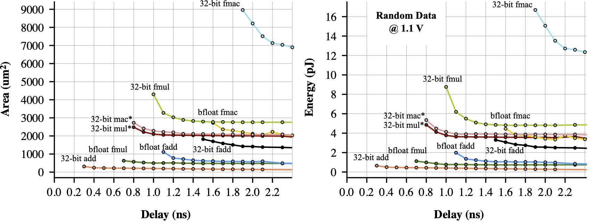
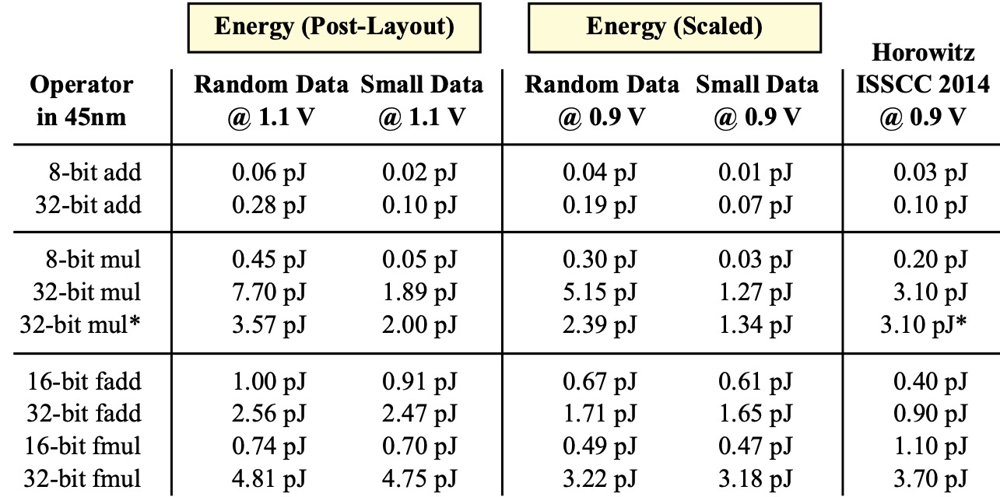

# Paper Artifact - Building First-Order Energy Modeling Intuition in Computer Architecture Lectures

[Paper link](https://www.csc2.ncsu.edu/faculty/efg/people/www/wcae2023.html)

<b>Author</b>: Christopher Torng 
<b>Contact</b>: ctorng [at] usc [dot] edu

<b>Repo Goals (work-in-progress)</b> - After discussing the ideas in this paper with other educators in computer architecture who may wish to replicate the above methodology, we now plan to release supplementary materials that may help you to generate similar baseline energy numbers for technologies other than the one used in the original paper.

  

  <b>Area, Energy, and Delay of Various Operators in 45nm Technology</b> - Numbers are collected post-layout for both area and energy in a commercial ASIC toolflow by sweeping target clock period across a large range. Each curve only shows the data points when operators meet timing.

  

<b>Table Data</b> - Table energy numbers correspond to the "knee" of the curve and reflect a semi-aggressive timing constraint. <i>Random Data</i> = uniform random bits toggling; <i>Small Data</i> = restricts the data range to [-0.5, 0.5] for floating point and uniform random in the lowest quarter of bits for integer; <i>Scaled</i> = energy scaling 1.1V to 0.9V with 1/2 CV^2 to compare with Horowitz ISSCC 2014; <i>Horowitz Data</i> = Horowitz ISSCC 2014 data; (*) = truncated result of lower 32 bits for 32-bit mul, unclear whether this was assumed in Horowitz ISSCC 2014.
  Please see the paper link above for more detail.

<b>Repo Status</b> - Stay tuned for updates in Summer 2023!

